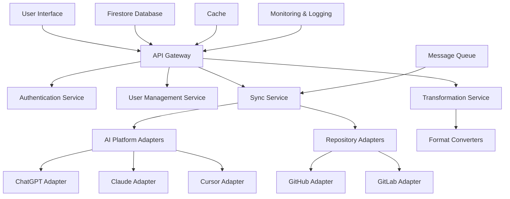

# AgenticMesh Refined Architecture

## Overview

AgenticMesh is a universal agent memory and synchronization framework designed to bridge AI platforms (like ChatGPT, Claude, Cursor) with version-controlled repositories (such as GitHub). It enables persistent, cross-model memory and configuration management using a modular architecture.

## Core Principles

1. **Model Agnostic**: Support multiple AI platforms with a unified interface.
2. **Bidirectional Sync**: Changes in either GitHub or AI platforms propagate to the other.
3. **Hierarchical Structure**: Support for user-level, organization-level, and project-level configurations.
4. **Secure Isolation**: Clear separation between personal and organizational resources.
5. **Extensible Design**: Easy to add support for new AI platforms or repository systems.
6. **Platform-Specific Configurations**: Manage platform-specific limitations and configurations.
7. **Resilience**: Gracefully handle failures and recover from errors.
8. **Transparency**: Provide clear visibility into synchronization status and history.

## System Architecture



### Modular Design

- **Microservices Architecture**: Each component (e.g., user management, synchronization, conversion) is a separate service.
- **Containerization**: Use Docker to encapsulate each service, allowing for independent deployment and scaling.
- **API Gateway**: Centralized entry point for all client requests, handling routing, authentication, and rate limiting.

### Authentication and Authorization

- **OAuth Integration**: Use OAuth for authentication with GitHub, Google (for ChatGPT), and other platforms.
- **JWT Tokens**: Use JWT for secure communication between services.
- **Role-Based Access Control**: Define roles and permissions for different users and organizations.
- **Multi-tenancy**: Support for multiple users and organizations with secure isolation.

### Data Management

- **Firestore Database**: Centralized database for managing configurations, state, and metadata.
- **Symlinks/References**: Avoid unnecessary duplication of data, especially for shared projects.
- **Data Versioning**: Maintain version history for all configurations and content.
- **Backup Strategy**: Regular backups of all data with point-in-time recovery.

### Synchronization

- **Bidirectional Sync**: Changes in either GitHub or AI platforms propagate to the other.
- **Conflict Resolution**: Define strategies for resolving conflicts when changes are made to the same resource in both systems.
- **Atomic Operations**: Ensure that synchronization operations are atomic to prevent data corruption.
- **Retry Mechanism**: Implement retry logic for failed operations with exponential backoff.

### Error Handling and Resilience

- **Circuit Breaker Pattern**: Prevent cascading failures by failing fast when a service is unavailable.
- **Graceful Degradation**: Continue to provide service even when some components fail.
- **Comprehensive Logging**: Log all errors with context for debugging and auditing.
- **Alerting**: Set up alerts for critical errors that require immediate attention.

### Performance

- **Asynchronous Processing**: Use message queues (e.g., RabbitMQ) for background tasks.
- **Caching**: Implement caching mechanisms to reduce latency and improve response times.
- **Rate Limiting**: Handle API rate limits imposed by platforms like ChatGPT or GitHub.
- **Performance Monitoring**: Track performance metrics and optimize bottlenecks.

### Scalability

- **Cloud Deployment**: Deploy on AWS or Google Cloud to leverage scalable infrastructure.
- **Load Balancers**: Distribute traffic evenly across services to ensure high availability.
- **Auto-scaling**: Automatically scale services based on demand.
- **Database Sharding**: Partition data to improve performance as the system grows.

### Security

- **Encryption**: Use encryption for sensitive data both at rest and in transit.
- **Secure Communication**: Use HTTPS for all API endpoints.
- **Vulnerability Scanning**: Regularly scan for vulnerabilities in dependencies.
- **Penetration Testing**: Conduct regular penetration testing to identify security issues.

### Flexibility

- **Plugin-Based Architecture**: Allow for easy addition of new features or integrations.
- **Versioned APIs**: Design APIs that are versioned and backward-compatible.
- **Feature Flags**: Use feature flags to enable/disable features without redeployment.
- **Configuration Management**: Externalize configuration to allow for changes without redeployment.

### Monitoring and Logging

- **Centralized Logging**: Use a centralized logging system (e.g., ELK stack) for all services.
- **Distributed Tracing**: Implement distributed tracing to track requests across services.
- **Metrics Collection**: Collect metrics on system health, performance, and usage.
- **Dashboards**: Create dashboards for monitoring system health and performance.

### Deployment

- **CI/CD Pipeline**: Automate testing, building, and deployment of services.
- **Environment Management**: Maintain separate environments for development, testing, and production.
- **Infrastructure as Code**: Define infrastructure using tools like Terraform or CloudFormation.
- **Blue-Green Deployment**: Use blue-green deployment to minimize downtime during updates.

### Testing

- **Unit Testing**: Test individual components in isolation.
- **Integration Testing**: Test interactions between components.
- **End-to-End Testing**: Test the entire system from a user's perspective.
- **Load Testing**: Test the system's performance under load.

### User Interface

- **Web Dashboard**: Provide a web-based dashboard for managing configurations and monitoring synchronization status.
- **CLI Tool**: Offer a command-line interface for automation and scripting.
- **API Documentation**: Provide comprehensive API documentation for developers.

## Component Details

### AI Platform Adapters

#### ChatGPT Adapter

- **Authentication**: OAuth with Google for patrickmwatson@lifehackinnovations.com and patrickmwatson@gmail.com.
- **Custom Instructions Handling**: Manage character limits and format conversions.
- **File Management**: Handle file uploads and downloads for knowledge base files.
- **Project Structure**: Map ChatGPT projects to GitHub repository structure.

#### Claude Adapter

- **Authentication**: API key-based authentication.
- **Custom Instructions Handling**: Manage format conversions for Claude-specific instructions.
- **File Management**: Handle file uploads and downloads for knowledge base files.

#### Cursor Adapter

- **MDC File Handling**: Convert between markdown and Cursor .mdc format.
- **Rule Management**: Map ChatGPT custom instructions to Cursor rules.

### Repository Adapters

#### GitHub Adapter

- **Authentication**: OAuth with GitHub.
- **Repository Management**: Create, update, and delete repositories.
- **File Management**: Manage files and directories within repositories.
- **Webhook Integration**: Set up webhooks for real-time updates.

#### GitLab Adapter

- **Authentication**: OAuth with GitLab.
- **Repository Management**: Create, update, and delete repositories.
- **File Management**: Manage files and directories within repositories.
- **Webhook Integration**: Set up webhooks for real-time updates.

### Transformation Service

- **Format Conversion**: Convert between different formats (markdown, .mdc, etc.).
- **Schema Validation**: Ensure format compliance across platforms.
- **Content Optimization**: Optimize content for platform-specific limitations.

### Sync Service

- **Change Detection**: Detect changes in both AI platforms and repositories.
- **Conflict Resolution**: Resolve conflicts when changes are made to the same resource.
- **Synchronization Logic**: Determine what to sync and when.
- **Retry Logic**: Handle failed synchronization attempts.

### User Management Service

- **User Registration**: Handle user registration and account creation.
- **Organization Management**: Manage organizations and their members.
- **Role Management**: Assign roles and permissions to users.

### Authentication Service

- **OAuth Integration**: Handle OAuth flows for different platforms.
- **Token Management**: Issue and validate JWT tokens.
- **Session Management**: Manage user sessions.

### API Gateway

- **Request Routing**: Route requests to appropriate services.
- **Authentication**: Validate authentication tokens.
- **Rate Limiting**: Enforce rate limits to prevent abuse.
- **Request/Response Transformation**: Transform requests and responses as needed.

## Project Structure

```
AgenticMesh/
├── docs/
│   ├── architecture.md
│   ├── api_specs/
│   └── deployment_guides/
├── src/
│   ├── api_gateway/
│   ├── auth_service/
│   ├── user_service/
│   ├── sync_service/
│   ├── transform_service/
│   ├── adapters/
│   │   ├── ai_platforms/
│   │   │   ├── chatgpt/
│   │   │   ├── claude/
│   │   │   └── cursor/
│   │   └── repositories/
│   │       ├── github/
│   │       └── gitlab/
│   └── common/
│       ├── models/
│       ├── utils/
│       └── config/
├── ui/
│   ├── web_dashboard/
│   └── cli_tool/
├── tests/
│   ├── unit/
│   ├── integration/
│   └── e2e/
├── deployment/
│   ├── docker/
│   ├── kubernetes/
│   └── terraform/
└── scripts/
    ├── setup/
    ├── migration/
    └── maintenance/
```

## Data Models

### User

```json
{
  "id": "string",
  "email": "string",
  "name": "string",
  "organizations": ["string"],
  "roles": ["string"],
  "created_at": "timestamp",
  "updated_at": "timestamp"
}
```

### Organization

```json
{
  "id": "string",
  "name": "string",
  "members": [
    {
      "user_id": "string",
      "role": "string"
    }
  ],
  "created_at": "timestamp",
  "updated_at": "timestamp"
}
```

### Project

```json
{
  "id": "string",
  "name": "string",
  "owner_id": "string",
  "organization_id": "string",
  "repository": {
    "platform": "string",
    "url": "string"
  },
  "ai_platforms": [
    {
      "platform": "string",
      "project_id": "string"
    }
  ],
  "created_at": "timestamp",
  "updated_at": "timestamp"
}
```

### SyncConfig

```json
{
  "id": "string",
  "project_id": "string",
  "source": {
    "platform": "string",
    "resource_id": "string"
  },
  "target": {
    "platform": "string",
    "resource_id": "string"
  },
  "sync_frequency": "string",
  "conflict_resolution": "string",
  "created_at": "timestamp",
  "updated_at": "timestamp"
}
```

### SyncHistory

```json
{
  "id": "string",
  "config_id": "string",
  "status": "string",
  "started_at": "timestamp",
  "completed_at": "timestamp",
  "changes": [
    {
      "resource_id": "string",
      "action": "string",
      "status": "string",
      "error": "string"
    }
  ]
}
```

## API Endpoints

### User Management

- `POST /api/v1/users` - Create a new user
- `GET /api/v1/users/{id}` - Get user details
- `PUT /api/v1/users/{id}` - Update user details
- `DELETE /api/v1/users/{id}` - Delete a user

### Organization Management

- `POST /api/v1/organizations` - Create a new organization
- `GET /api/v1/organizations/{id}` - Get organization details
- `PUT /api/v1/organizations/{id}` - Update organization details
- `DELETE /api/v1/organizations/{id}` - Delete an organization
- `POST /api/v1/organizations/{id}/members` - Add a member to an organization
- `DELETE /api/v1/organizations/{id}/members/{user_id}` - Remove a member from an organization

### Project Management

- `POST /api/v1/projects` - Create a new project
- `GET /api/v1/projects/{id}` - Get project details
- `PUT /api/v1/projects/{id}` - Update project details
- `DELETE /api/v1/projects/{id}` - Delete a project

### Sync Management

- `POST /api/v1/sync/configs` - Create a new sync configuration
- `GET /api/v1/sync/configs/{id}` - Get sync configuration details
- `PUT /api/v1/sync/configs/{id}` - Update sync configuration
- `DELETE /api/v1/sync/configs/{id}` - Delete a sync configuration
- `POST /api/v1/sync/configs/{id}/trigger` - Trigger a sync operation
- `GET /api/v1/sync/history` - Get sync history
- `GET /api/v1/sync/history/{id}` - Get details of a specific sync operation

## Implementation Phases

### Phase 1: Core Infrastructure

- Set up the basic project structure
- Implement the authentication service
- Implement the user management service
- Set up the Firestore database
- Implement the API gateway

### Phase 2: GitHub Integration

- Implement the GitHub adapter
- Set up webhook integration
- Implement repository management functionality
- Implement file management functionality

### Phase 3: ChatGPT Integration

- Implement the ChatGPT adapter
- Handle custom instructions synchronization
- Handle file uploads and downloads
- Map ChatGPT projects to GitHub repositories

### Phase 4: Sync Service

- Implement change detection
- Implement conflict resolution
- Implement synchronization logic
- Set up the message queue for background processing

### Phase 5: Transformation Service

- Implement format conversion
- Implement schema validation
- Implement content optimization

### Phase 6: User Interface

- Develop the web dashboard
- Develop the CLI tool
- Create comprehensive API documentation

### Phase 7: Additional Integrations

- Implement the Claude adapter
- Implement the Cursor adapter
- Implement the GitLab adapter

### Phase 8: Monitoring and Optimization

- Set up centralized logging
- Implement distributed tracing
- Create dashboards for monitoring
- Optimize performance and scalability

## Next Steps

1. **Set Up a Development Environment**: Configure a development environment with the necessary tools and services to start building the components.
2. **Develop a Proof of Concept**: Implement a small-scale version of the architecture to validate the design and identify any potential issues.
3. **Create a Project Management Plan**: Break down the implementation phases into specific tasks and assign priorities.