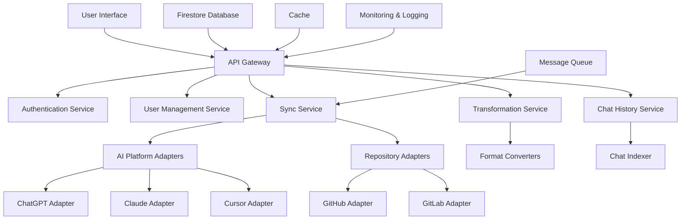

# AgenticMesh Refined Architecture

## Overview

AgenticMesh is a universal agent memory and synchronization framework designed to bridge AI platforms (like ChatGPT, Claude, Cursor) with version-controlled repositories (such as GitHub). It enables persistent, cross-model memory and configuration management using a modular architecture.

## Core Principles

1. **Model Agnostic**: Support multiple AI platforms with a unified interface.
2. **Bidirectional Sync**: Changes in either GitHub or AI platforms propagate to the other.
3. **Hierarchical Structure**: Support for user-level, organization-level, and project-level configurations.
4. **Secure Isolation**: Clear separation between personal and organizational resources.
5. **Extensible Design**: Easy to add support for new AI platforms or repository systems.
6. **Platform-Specific Configurations**: Manage platform-specific limitations and configurations.
7. **Resilience**: Gracefully handle failures and recover from errors.
8. **Transparency**: Provide clear visibility into synchronization status and history.
9. **Chat History Preservation**: Store and index full chat histories for each project and user.

## System Architecture



### Modular Design

- **Microservices Architecture**: Each component (e.g., user management, synchronization, conversion) is a separate service.
- **Containerization**: Use Docker to encapsulate each service, allowing for independent deployment and scaling.
- **API Gateway**: Centralized entry point for all client requests, handling routing, authentication, and rate limiting.

### Authentication and Authorization

- **OAuth Integration**: Use OAuth for authentication with GitHub, Google (for ChatGPT), and other platforms.
- **JWT Tokens**: Use JWT for secure communication between services.
- **Role-Based Access Control**: Define roles and permissions for different users and organizations.
- **Multi-tenancy**: Support for multiple users and organizations with secure isolation.

### Data Management

- **Firestore Database**: Centralized database for managing configurations, state, and metadata.
- **Symlinks/References**: Avoid unnecessary duplication of data, especially for shared projects.
- **Data Versioning**: Maintain version history for all configurations and content.
- **Backup Strategy**: Regular backups of all data with point-in-time recovery.

### Synchronization

- **Bidirectional Sync**: Changes in either GitHub or AI platforms propagate to the other.
- **Conflict Resolution**: Define strategies for resolving conflicts when changes are made to the same resource in both systems.
- **Atomic Operations**: Ensure that synchronization operations are atomic to prevent data corruption.
- **Retry Mechanism**: Implement retry logic for failed operations with exponential backoff.

### Error Handling and Resilience

- **Circuit Breaker Pattern**: Prevent cascading failures by failing fast when a service is unavailable.
- **Graceful Degradation**: Continue to provide service even when some components fail.
- **Comprehensive Logging**: Log all errors with context for debugging and auditing.
- **Alerting**: Set up alerts for critical errors that require immediate attention.

### Performance

- **Asynchronous Processing**: Use message queues (e.g., RabbitMQ) for background tasks.
- **Caching**: Implement caching mechanisms to reduce latency and improve response times.
- **Rate Limiting**: Handle API rate limits imposed by platforms like ChatGPT or GitHub.
- **Performance Monitoring**: Track performance metrics and optimize bottlenecks.

### Scalability

- **Cloud Deployment**: Deploy on AWS or Google Cloud to leverage scalable infrastructure.
- **Load Balancers**: Distribute traffic evenly across services to ensure high availability.
- **Auto-scaling**: Automatically scale services based on demand.
- **Database Sharding**: Partition data to improve performance as the system grows.

### Security

- **Encryption**: Use encryption for sensitive data both at rest and in transit.
- **Secure Communication**: Use HTTPS for all API endpoints.
- **Vulnerability Scanning**: Regularly scan for vulnerabilities in dependencies.
- **Penetration Testing**: Conduct regular penetration testing to identify security issues.

### Flexibility

- **Plugin-Based Architecture**: Allow for easy addition of new features or integrations.
- **Versioned APIs**: Design APIs that are versioned and backward-compatible.
- **Feature Flags**: Use feature flags to enable/disable features without redeployment.
- **Configuration Management**: Externalize configuration to allow for changes without redeployment.

### Monitoring and Logging

- **Centralized Logging**: Use a centralized logging system (e.g., ELK stack) for all services.
- **Distributed Tracing**: Implement distributed tracing to track requests across services.
- **Metrics Collection**: Collect metrics on system health, performance, and usage.
- **Dashboards**: Create dashboards for monitoring system health and performance.

### Chat History Management

- **Chat Data Model**: Define a schema for storing chat data, including metadata like timestamps, participants, and attachments.
- **Incremental Synchronization**: Implement a mechanism for importing chats in batches or on-demand to avoid overloading the system.
- **Search and Indexing**: Implement search capabilities for chat data, potentially using external tools for indexing and querying.
- **Access Control**: Ensure appropriate permissions are enforced for accessing chat data.
- **Data Retention Policies**: Define policies for how long chat data is retained and how it's archived or deleted.

## Component Details

*[Existing component details omitted for brevity]*

### Chat History Service

- **Chat Ingestion**: Ingest chat data from AI platforms, handling pagination and incremental synchronization.
- **Chat Storage**: Store chat data in a scalable and searchable format.
- **Indexing**: Index chat data for efficient querying and retrieval.
- **Search API**: Expose an API for searching and retrieving chat data.
- **Access Control**: Enforce access controls and permissions for chat data.
- **Data Retention**: Implement data retention policies, including archival and deletion.

## Data Models

*[Existing data models omitted for brevity]*

### Chat

```json
{
  "id": "string",
  "timestamp": "datetime",
  "platform": "string",
  "participants": [
    {
      "id": "string",
      "name": "string"
    }
  ],
  "content": "string",
  "attachments": [
    {
      "id": "string",
      "type": "string",
      "url": "string"
    }
  ],
  "project_id": "string",
  "user_id": "string"
}
```

## API Endpoints

*[Existing API endpoints omitted for brevity]*

### Chat History

- `POST /api/v1/chats/import` - Import a batch of chats
- `GET /api/v1/chats/search` - Search for chats based on criteria
- `GET /api/v1/chats/{id}` - Get a specific chat by ID
- `DELETE /api/v1/chats/{id}` - Delete a specific chat by ID

## Implementation Phases

*[Existing phases omitted for brevity]*

### Phase 9: Chat History Management

- Implement the chat data model and storage
- Develop the chat ingestion and incremental synchronization mechanism
- Implement search and indexing capabilities for chat data
- Expose APIs for importing, searching, and retrieving chats
- Integrate chat history with the user interface

## Next Steps

1. **Review and Approve Architecture**: Review the updated architecture with stakeholders and get approval.
2. **Update Implementation Plan**: Update the implementation plan to include the new chat history management phase.
3. **Proceed with Implementation**: Continue with the implementation, incorporating the chat history management capabilities in the designated phase.