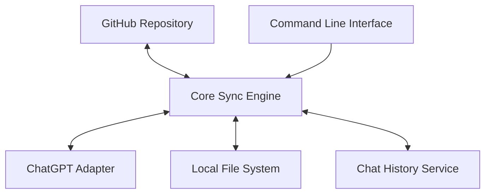

# Simplified Implementation Plan for AgenticMesh

## Introduction

This document outlines a simplified, incremental approach to implementing AgenticMesh. Following the KISS (Keep It Simple, Stupid) principle, we'll break down the project into small, manageable steps that provide immediate value and can be tested independently.

## Core Philosophy

1. **Incremental Value**: Each step should provide tangible value on its own
2. **Independent Testing**: Components should be testable without requiring the entire system
3. **Source of Truth**: GitHub repositories serve as the single source of truth
4. **Psychological Momentum**: Early wins to maintain motivation and momentum
5. **Simplicity First**: Start with the simplest implementation, then enhance as needed

## Simplified Architecture

Instead of implementing the full microservices architecture immediately, we'll start with a monolithic approach that can be broken down later:

## Phase 0: Proof of Concept (1-2 days)

Create a simple proof of concept that demonstrates the core functionality:

1. **Manual Export**: Manually export custom instructions from ChatGPT
2. **GitHub Storage**: Store them in a GitHub repository
3. **Manual Import**: Manually import them back into ChatGPT

**Success Criteria**: Successfully round-trip custom instructions between ChatGPT and GitHub.

## Phase 1: Basic CLI Tool (3-5 days)

Create a simple command-line tool that automates the export/import process:

1. **Setup Command**: Initialize the local repository structure
2. **Export Command**: Export custom instructions from ChatGPT to local files
3. **Commit Command**: Commit changes to GitHub
4. **Import Command**: Import custom instructions from local files to ChatGPT

**Success Criteria**: Automate the manual process from Phase 0.

## Phase 2: Single User Sync (1 week)

Enhance the CLI tool to support bidirectional sync for a single user:

1. **Authentication**: Add authentication for ChatGPT and GitHub
2. **Change Detection**: Detect changes in both ChatGPT and GitHub
3. **Basic Sync**: Sync changes between ChatGPT and GitHub
4. **Conflict Resolution**: Handle basic conflicts

**Success Criteria**: Changes in either ChatGPT or GitHub automatically sync to the other.

## Phase 3: Knowledge Base Files (1 week)

Add support for knowledge base files:

1. **File Export**: Export knowledge base files from ChatGPT
2. **File Import**: Import knowledge base files to ChatGPT
3. **File Sync**: Sync knowledge base files between ChatGPT and GitHub

**Success Criteria**: Successfully sync knowledge base files between ChatGPT and GitHub.

## Phase 4: Project Structure (1 week)

Add support for projects:

1. **Project Export**: Export projects from ChatGPT
2. **Project Import**: Import projects to ChatGPT
3. **Project Sync**: Sync projects between ChatGPT and GitHub

**Success Criteria**: Successfully sync projects between ChatGPT and GitHub.

## Phase 5: Multiple Users (1-2 weeks)

Add support for multiple users:

1. **User Management**: Add support for multiple users
2. **User Isolation**: Ensure user data is isolated
3. **User Authentication**: Handle authentication for multiple users

**Success Criteria**: Successfully sync data for multiple users without interference.

## Phase 6: Organization Support (1-2 weeks)

Add support for organizations:

1. **Organization Management**: Add support for organizations
2. **Shared Projects**: Support for shared projects
3. **Access Control**: Basic access control for shared projects

**Success Criteria**: Successfully share projects within an organization.

## Phase 7: Cursor Integration (1-2 weeks)

Add support for Cursor:

1. **MDC Conversion**: Convert between markdown and Cursor .mdc format
2. **Cursor Sync**: Sync custom instructions to Cursor rules

**Success Criteria**: Successfully sync custom instructions to Cursor rules.

## Phase 8: Web Dashboard (2-3 weeks)

Create a simple web dashboard:

1. **User Interface**: Create a basic user interface
2. **Project Management**: Manage projects through the UI
3. **Sync Status**: View sync status and history

**Success Criteria**: Successfully manage the system through a web interface.

## Phase 9: Chat History Management (3-4 weeks)

Implement chat history storage and retrieval:

1. **Chat Data Model**: Define a schema for storing chat data
2. **Incremental Synchronization**: Implement a mechanism for importing chats in batches or on-demand
3. **Search and Indexing**: Implement search capabilities for chat data
4. **Access Control**: Ensure appropriate permissions are enforced for accessing chat data
5. **Data Retention Policies**: Define policies for how long chat data is retained

**Success Criteria**: Successfully store, index, and retrieve chat histories for projects and users.

## Implementation Approach

### Start with a Simple Monolith

Instead of immediately implementing a microservices architecture, start with a simple monolithic application that can be broken down later:

1. **Single Codebase**: Keep all code in a single repository
2. **Simple Data Storage**: Use local files and a simple database
3. **Minimal Dependencies**: Minimize external dependencies

### Focus on Core Functionality First

Implement the core functionality first, then add additional features:

1. **ChatGPT Sync**: Focus on syncing with ChatGPT first
2. **Single User**: Support a single user before adding multi-user support
3. **CLI First**: Build the CLI tool before the web dashboard

### Use Simple Technologies

Use simple, well-understood technologies:

1. **Node.js**: Use Node.js for the backend
2. **SQLite**: Use SQLite for local data storage
3. **GitHub API**: Use the GitHub API for repository management
4. **Puppeteer**: Use Puppeteer for ChatGPT interaction (until an official API is available)

### Incremental Testing

Test each component independently:

1. **Unit Tests**: Write unit tests for core functionality
2. **Manual Testing**: Manually test the system at each phase
3. **Continuous Integration**: Set up CI to run tests automatically

## Development Workflow

1. **Plan**: Define the specific tasks for the current phase
2. **Implement**: Implement the tasks
3. **Test**: Test the implementation
4. **Deploy**: Deploy the changes
5. **Review**: Review the results and adjust the plan for the next phase

## Getting Started

### Phase 0: Proof of Concept

1. **Create a GitHub Repository**: Create a new repository for AgenticMesh
2. **Export Custom Instructions**: Manually export custom instructions from ChatGPT
3. **Commit to GitHub**: Commit the exported instructions to GitHub
4. **Import Custom Instructions**: Manually import the instructions back into ChatGPT
5. **Verify**: Verify that the instructions are correctly imported

### Phase 1: Basic CLI Tool

1. **Set Up Project**: Create a new Node.js project
2. **Implement Setup Command**: Implement a command to initialize the local repository structure
3. **Implement Export Command**: Implement a command to export custom instructions from ChatGPT
4. **Implement Commit Command**: Implement a command to commit changes to GitHub
5. **Implement Import Command**: Implement a command to import custom instructions to ChatGPT
6. **Test**: Test the commands to ensure they work correctly

## Conclusion

By following this simplified, incremental approach, we can build AgenticMesh in a way that provides immediate value, maintains momentum, and avoids unnecessary complexity. Each phase builds on the previous one, allowing for independent testing and continuous progress.

Remember: The goal is to simplify your life, not complicate it. Keep the focus on creating a single source of truth for your AI agent configurations, and build the system in a way that makes it easy to maintain and extend. The addition of chat history management capabilities will provide a comprehensive solution for preserving and accessing your AI interactions over time.